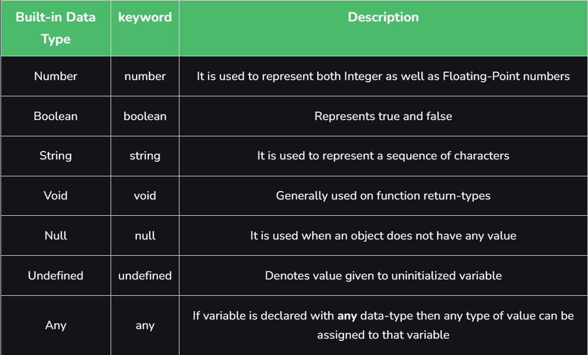
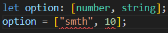

## TypeScript is JavaScript with added syntax for types.

### Data types in TypeScript



<br>

__JavaScript va TypeScript-da uchta asosiy primativlar mavjud.__

- __boolean__ - true yoki false qiymatlar
```
let isHave: boolean = true;
isHave = false;
```

<br>

- __number__ - butun sonlar
```
let num: number = 22;
num = 32;
```
<br>

- __string__ - " " kabi matn qiymatlari 
```
let fname: string = "Anna";
fname = "Lucy";
```

Bundan tashqari, Javascript va TypeScript ning keyingi versiyalarida ishlatiladigan ikkita qo'shimcha primativlar mavjud.

- __bigint__ - butun sonlar, lekin raqam turiga qaraganda kattaroq salbiy va musbat raqamlarga ruxsat beradi.
- __symbol__ - global noyob identifikator yaratish uchun ishlatiladi.

__For example:__

```
let a: null = null;

let b: number = 456;

let c: number = 989.956;

let d: string = 'something';

let e: undefined = undefined;

let f: boolean = true;

let g: number = 0b111001; // Binary
let h: number = 0o436; // Octal
let i: number = 0xadf0d; // Hexa-Decimal
```

<br>

__Agar o'zgaruvchi istalgan turdagi ma'lumotlar bilan e'lon qilingan bo'lsa, biz ushbu o'zgaruvchiga istalgan turdagi qiymatni belgilashimiz mumkin.__

```
let a: any = null;

let b: any =123;

let c: any = 123.456;

let d: any = "some";

let e: any = undefined;

let f: any = true;
```


<br>

### Union types
- Single typelarga qaraganda ko'proq qiymat tayinlay oladi. Masalan number yoki string. Ularni | bilan yoziladi. 
```
let age: number | string;
age = 20;
age = "20";
```


<br>

### Dynamic types
- __any__ typescriptni javascriptga qaytaradi
```
let year: any = 2024;
year = true;
```

<br>

### Literal types
- Literal typelardan foydalanish orqali biz string, number yoki boolean qiymatga ega boʻlishi kerak boʻlgan aniq qiymatga ruxsat berishimiz mumkin. Faqat o'zida bor qiymatni berish mumkun!
```
let direction: "Up" | "Down";
direction = "Up";
direction = "something"; // error
```
<br>

### Objects
- Oldin ularni ichida nima borligini e'lon qilib keyin qiymat tayinlanadi.
```
let person: {
  name: string;
  age: number;
  isStudent: boolean;
};

person = {
  name: "Anna",
  age: 22,
  isStudent: true,
};

console.log(person)
```

<br>

### Arrays
- Biz arrayda qanday ma'lumotlar bo'lishi mumkunligini aniqlashimiz mumkun. Agar ko'plab ma'lumotlar kelib qolsa __any__ berishimiz ham mumkun.
```
let arr: number[] = [1, 2, 3, 4];
let arr: (number | string)[] = [1, 2, 3, 4, 'a', 'b'];


// Generic type:
let str: Array<string> = ['a', 'b', 'c']
let str: Array<string | number> = ['a', 'b', 'c', 56]
```

### Tuples
- Typelar bir-biriga mos bo'lishi kerak, o'rni almashishi ham mumkun emas. Agar o'rni almashsa xatolik beradi.

```
let option: [number, string];
option = [10, "smth"];


let option: [number, string, boolean];
option = [10, "smth", true];
```
<br>

__O'rni almashsa:__ <br>


<br>

### Functions
```
function sumNumber(a: number, b: number): number {
  return a - b;
}

const result: number = sumNumber(10, 5);
console.log(result);
```
<br>

- nimadur ish bajarsa __void__ function bo'ladi
```
// Void function

function voidFunc(): void {
  console.log("This is void function");
}

voidFunc();
```

<br>

- Errorlar uchun:
```
function neverFunc(): never {
  throw new Error("These all Errors");
}

neverFunc();
```

<br>

### Type Aliases
- interface bilan bir xil ishlidi. Faqat Type Aliasesda - extend qilib bo'midi, Interfaceda esa extend qilish mumkun.

```
type units = string | number
let result: units = 24
```

<br>

### Interface
- Ichida bor bo'lmasa xatolik beradi, extend olish mumkun. Non-primative(Object va Array) typelarga __interface__ yozish kerak. 
```
interface Person{
    name: string,
    age: number
}

let info: Person{
    name: "Anna",
    age: 22
}
```
<br>

```
// Task 

interface brandColor {
  name: string;
  color: string;
}

interface units {
  title: string;
  sizes: size[];
}

interface size {
  name: string;
}

interface product {
  name: string;
  images: string[];
  price: string;
  shortDescription: string;
  longDescription: string;
  category: string;
  subCategory: string;
  brand: string;
  count: number;
  colors: brandColor[];
  units: units;
}

let allProducts: product = {
  name: "Smartfon iPhone 14 Pro 128GB Purple",
  images: [
    "https://images.uzum.uz/ci1g91rltlh4bk4laa30/original.jpg",
    "https://images.uzum.uz/ci1g91r6edfostigj1u0/original.jpg",
    "https://images.uzum.uz/ci1g92bltlh4bk4laa4g/original.jpg",
  ],
  price: "15000000",
  shortDescription:
    "Markaziy protsessor Apple Bionic A16 Ekran o'lchamlari 2556x1179 CPU chastotasi 2300 MGts Eshitish vositasi chiqishi Lighting Aloqa standarti 2G 3G 4G LTE 5G",
  longDescription:
    "Markaziy protsessor Apple Bionic A16 Ekran o'lchamlari 2556x1179 CPU chastotasi 2300 MGts Eshitish vositasi chiqishi Lighting Aloqa standarti 2G 3G 4G LTE 5G",
  category: "64c6de0d4d748db5916c3d30",
  subCategory: "64c8d732b823d24b1c38835a",
  brand: "64ca3c52afa7a02dcbcf49c6",
  count: 10,
  colors: [
    {
      name: "Qora",
      color: "#000",
    },
    {
      name: "Oq",
      color: "#fff",
    },
  ],
  units: {
    title: "Xotira",
    sizes: [
      {
        name: "128GB",
      },
      {
        name: "256GB",
      },
    ],
  },
};
```