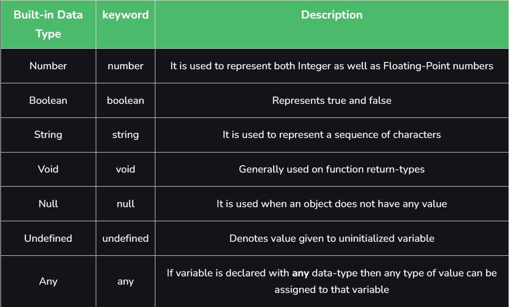

## TypeScript is JavaScript with added syntax for types.

## Data types in TypeScript



<br>

__JavaScript va TypeScript-da uchta asosiy primitiv mavjud.__

- __boolean__ - true yoki false qiymatlar
- __number__ - butun sonlar
- __string__ - " " kabi matn qiymatlari <br>

Bundan tashqari, Javascript va TypeScript ning keyingi versiyalarida ishlatiladigan ikkita qo'shimcha primativlar mavjud.

- __bigint__ - butun sonlar, lekin raqam turiga qaraganda kattaroq salbiy va musbat raqamlarga ruxsat beradi.
- __symbol__ - global noyob identifikator yaratish uchun ishlatiladi.

__For example:__

```
let a: null = null;

let b: number = 456;

let c: number = 989.956;

let d: string = 'something';

let e: undefined = undefined;

let f: boolean = true;

let g: number = 0b111001; // Binary
let h: number = 0o436; // Octal
let i: number = 0xadf0d; // Hexa-Decimal
```

<br>

__Agar o'zgaruvchi istalgan turdagi ma'lumotlar bilan e'lon qilingan bo'lsa, biz ushbu o'zgaruvchiga istalgan turdagi qiymatni belgilashimiz mumkin.__

```
let a: any = null;

let b: any =123;

let c: any = 123.456;

let d: any = "some";

let e: any = undefined;

let f: any = true;
```